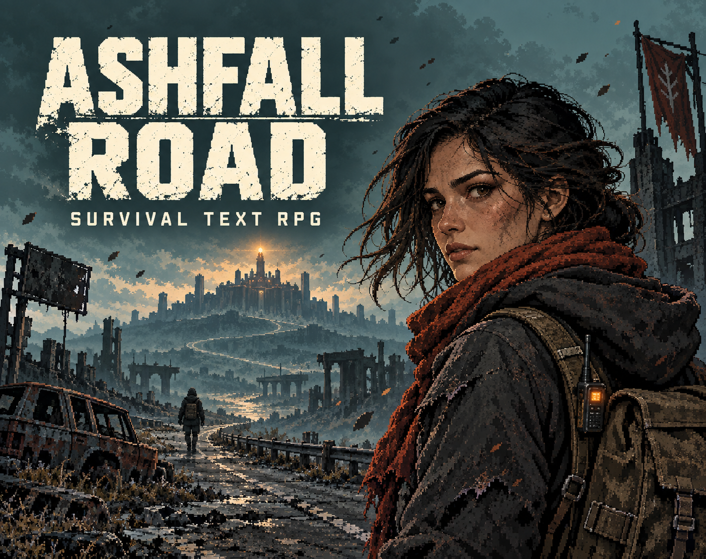
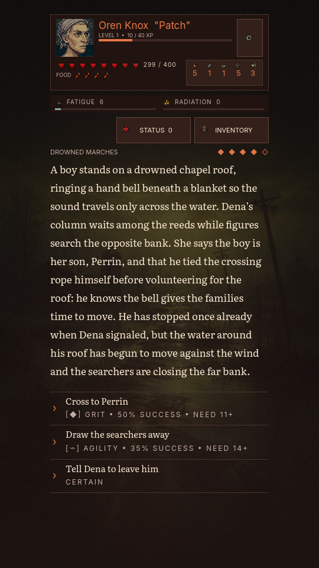
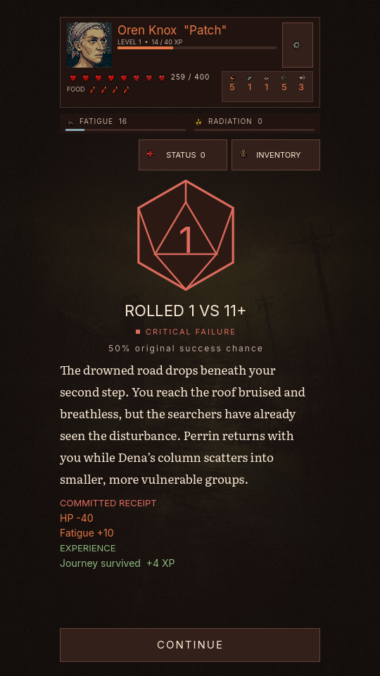
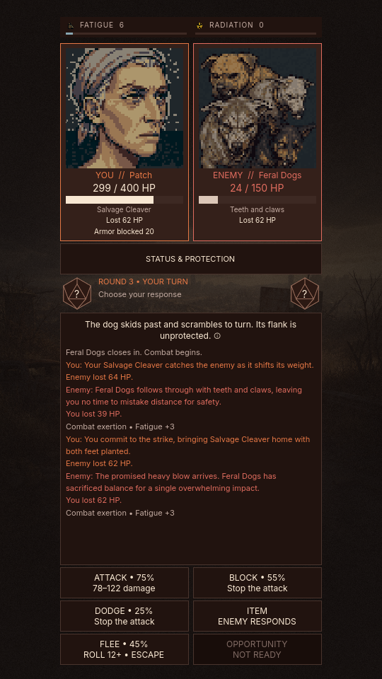
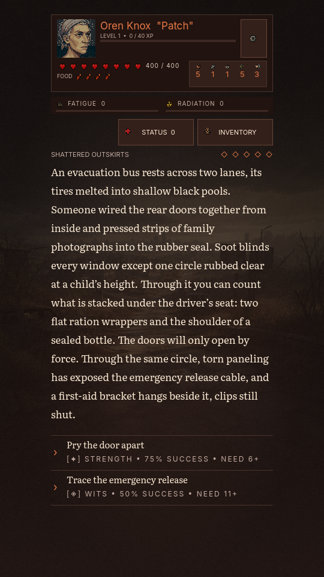
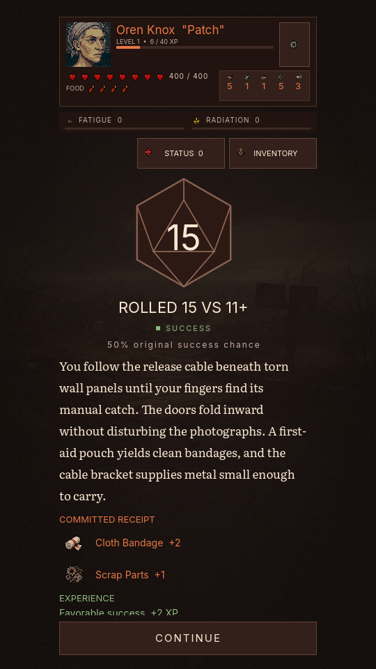
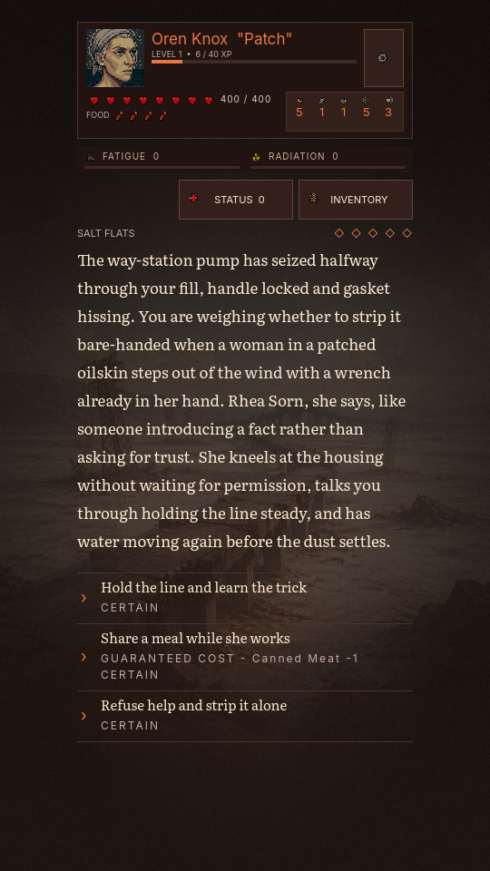
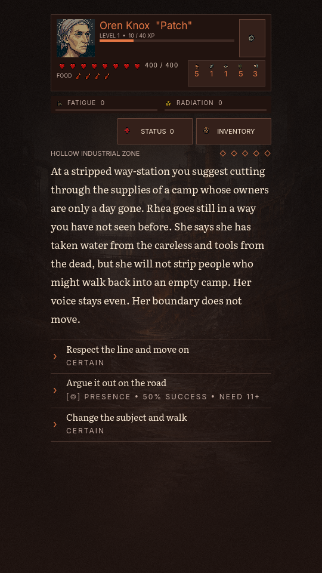
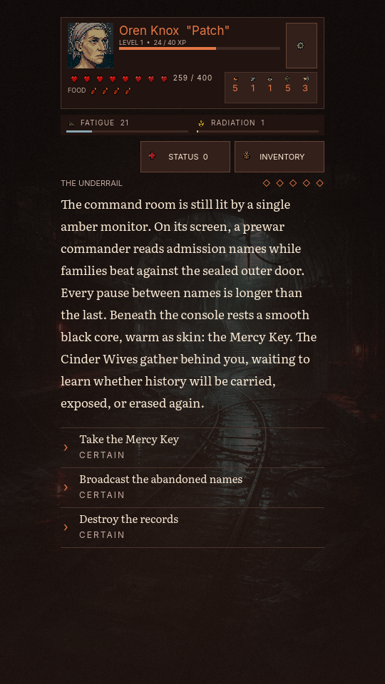

# Ashfall Road

> **Walk until the road ends.**

An offline, story-driven survival RPG about the price of getting one more mile east. Read the danger, choose what you can afford to lose, and live with what the road remembers.

**153 authored events · 440+ choices · 480+ outcomes · 30,000+ words · 23 adversaries.** One life, six regions, and no reset when a decision goes badly.

## Download the playtest

| Platform | Download | How to play |
|---|---|---|
| Windows 64-bit | [Windows playtest ZIP](downloads/Ashfall-Road-0.2.1-playtest-Windows.zip) | Extract the ZIP and run `ashfall-road.exe` with `ashfall-road.pck` beside it. |
| Android 7.0+ | [Android playtest ZIP](downloads/Ashfall-Road-0.2.1-playtest-Android.zip) | Extract the ZIP and install `ashfall-road-debug.apk` on an arm64 or x86_64 device. |

Both builds work offline. The Windows executable is unsigned and the Android APK is debug-signed for trial use. See the [playtest instructions and SHA-256 checksums](docs/ADMISSIONS_PLAYTEST.md).

The title menu offers **New run** to choose a survivor. If this device already has a saved run, **Continue** appears alongside it. During a run, open **Settings → Start New Run**. The old save stays available until you choose a new survivor.

## See the game

These 540×960 screenshots come from the running Godot UI. The [capture script](tools/readme_showcase.gd) selects authored scenes and resolves the pictured rolls and combat turns through the game engine.

> **Playtest art:** Some enemy and survivor portraits, along with some item icons, are still temporary or awaiting final artwork. The screenshots show the current playable build; the Feral Dogs portrait shown below is included.

### One child, or the safety of a column

Perrin is keeping a fleeing group safe by ringing a muffled bell from a flooded chapel roof. Rescue him, draw the searchers away, or tell his mother to leave him. A failed rescue saves Perrin but scatters the families and leaves you badly hurt.

| Make the call | Live with the result |
|:---:|:---:|
|  |  |

### A fight already in motion

The Feral Dogs have taken 126 HP. Your survivor has lost 101. The next committed tell, the exchange log, and every tactical action remain visible while the fight is still live.

### Choices with visible odds

At an evacuation bus, forcing the doors has better odds, while tracing the release may recover medical supplies. The game shows the exact chance and required D20 roll before you commit, then records what happened and what you gained.

| Choose your approach | See the consequence |
|:---:|:---:|
|  |  |

### People return with boundaries of their own

Rhea Sorn first helps you repair a pump. Later, she pushes back when survival means taking from people who may return. Recurring characters carry their histories into later regions, and your choices shape those encounters.

| Meet Rhea | Meet her again |
|:---:|:---:|
|  |  |

### What the road buried

Deep in Bunker Forty-One, you find the record of an evacuation that chose who entered and who was left outside. Carry its key, broadcast the abandoned names, or destroy the evidence.

## What a run asks of you

1. **Choose a survivor.** Three randomly generated candidates have equal stat budgets and different builds. Grit determines hearts; your strongest stat shapes your starting kit.
2. **Make hard calls.** Travel through five events per region. Checked choices show their exact odds, and natural 1s and 20s can turn a scene sharply.
3. **Manage the cost.** Food, fatigue, radiation, injury, carrying weight, ammo, and conditions all matter. Hunger advances as the journey does.
4. **Fight with intent.** Attack, block, dodge, use an item, flee, or spend a once-per-fight Opportunity. Enemies commit to readable moves; good timing creates Riposte and Opening windows.
5. **Carry the consequences.** Earn XP, invest stat points at checkpoints, and decide whether to rest or press on. Companion stories and the three-stage finale respond to earlier choices. Death ends the run and writes its Chronicle entry.

The content includes **82 items, 19 conditions, five recurring human story threads, 54 lore chapters**, and the last 20 run summaries in the Road Chronicle.

## Built to hold together

- **Deterministic engine:** the same seed and decisions produce the same replay. Previews and resolution share the same rules; the UI does not decide outcomes.
- **Crash-safe saves:** atomic JSON writes, backup recovery, and prepare/commit/retry transactions protect rolls, combat turns, XP, and death from duplicate or lost progress.
- **Data-driven stories:** events, items, adversaries, and prose overrides live in JSON and pass a mechanical-snapshot equality check.
- **Portrait phone UI:** supports compact and tall screens, three text sizes, high contrast, reduced motion, and typewriter reveal with a skip gesture.
- **Measured balance:** the project records 586,000 simulated combat encounters and a 1,000-run full-journey soak with zero engine errors. The automated suite reports 3,645 assertions with zero failures.

## Run locally

1. Open this directory in **Godot 4.7.2 Standard**.
2. Press **F6** or **F5** to run the game.
3. See [testing](docs/TESTING.md) for the automated suite and capture commands.

The launch game works offline. It has no ads or purchases. Android monetization adapters and the Firebase verification backend are deferred beyond v1.

## Project guides

- [Current implementation status](docs/PROJECT_STATUS.md)
- [Windows and Android setup](docs/ANDROID_SETUP.md)
- [Content authoring](docs/CONTENT_AUTHORING.md)
- [Testing](docs/TESTING.md)
- [Balance workflow](docs/BALANCE_WORKFLOW.md)
- [Visual style guide](docs/UI_STYLE_GUIDE.md)
- [Story map](docs/STORY_MAP.md)
- [Bunker Forty-One narrative map](docs/BUNKER41_NARRATIVE.md)
- [Living Road narrative bible](docs/LIVING_ROAD_NARRATIVE_BIBLE.md)
- [Narrative combat report](docs/NARRATIVE_COMBAT_REPORT.md)
- [Combat and relationships](docs/Combat+relationships.md)
- [Itch.io public playtest packet](docs/E05_PLAYTEST_PACKET.md)
- [Release checklist](docs/RELEASE_CHECKLIST.md)
