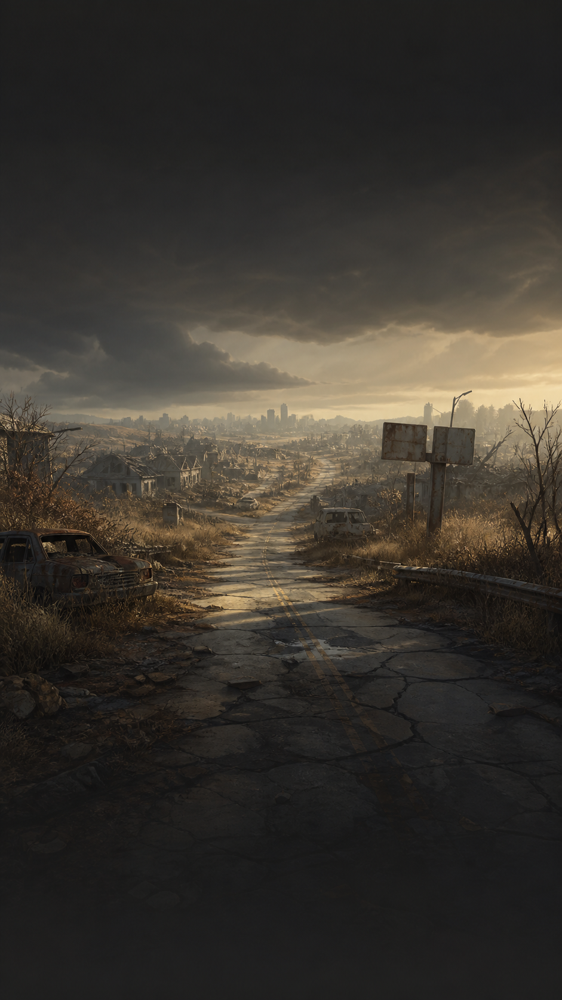
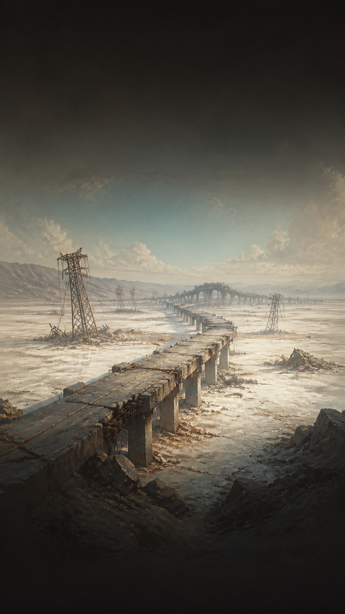
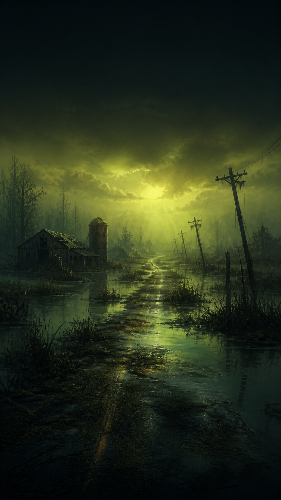
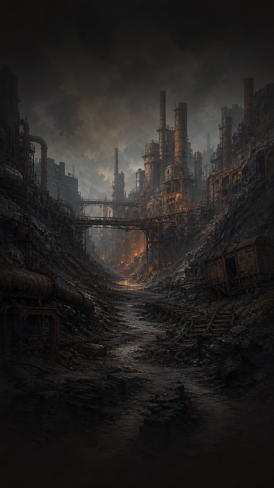
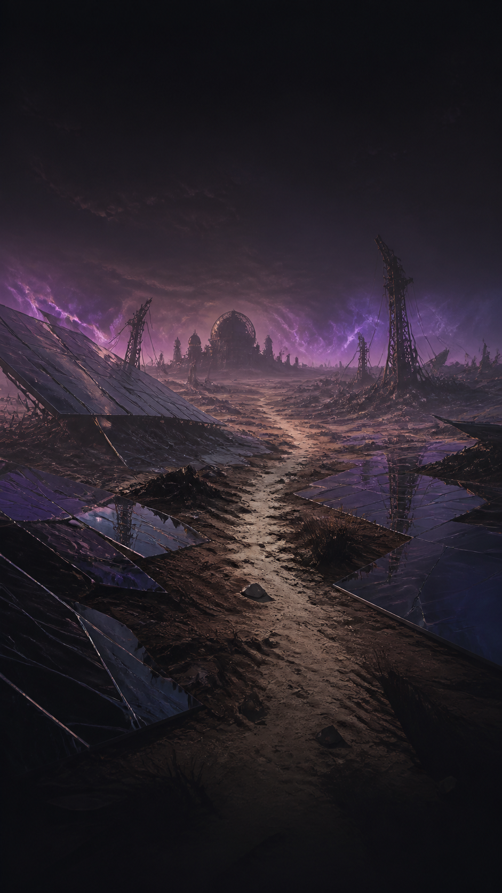
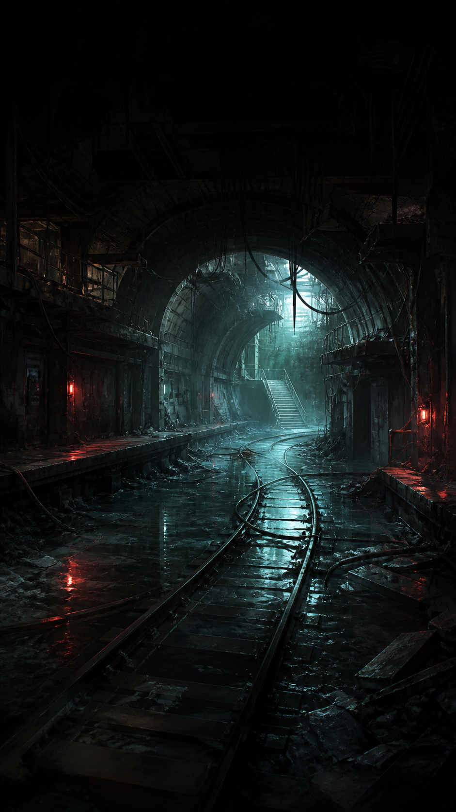
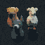
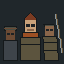
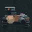

# Ashfall Road

> A complete offline post-apocalyptic survival game with tactical combat.
> Features **153 events, 440+ choices and 480+ unique outcomes with 30,000+ words**.
> Validated with **3,600+ automated tests, 586,000 simulated battles, and 1,000 full playthroughs with zero crashes**.

Built with **Godot 4.7.2 + GDScript**. Portrait 393×852, offline-first, no ads, no purchases in v1.

## The world

Six hand-painted regions, travelled in fixed order — outskirts to underrail — each with its own dangers, supply chances, and story chains.

| Shattered Outskirts | Salt Flats | Drowned Marches |
|---|---|---|
|  |  |  |

| Hollow Industrial | Glass Wastes | The Underrail |
|---|---|---|
|  |  |  |

## Your survivors

Pick 1 of 3 randomly generated survivors — equal budgets, different builds. Grit sets your hearts, your highest stat sets your starting kit.

| | | |
|---|---|---|
|  |  |  |

## Your enemies

23 authored adversaries with readable tells and unique traits — brood-hatching widows, heat-venting kilnbacks, flood-raising maws, charge-stealing cable eaters, prediction punishers, bleeding hounds.

| Feral Dogs | Road Bandits | Ash Stalker |
|---|---|---|
|  |  |  |

| Toll Gang | Leeches | The Warden |
|---|---|---|
|  |  |  |

## How a run plays

1. **Choose** your survivor from 3 candidates.
2. **Travel** 6 regions × 5 events — checked D20 rolls with exact odds shown, concealed persisted results, natural 1/20 drama.
3. **Survive** — hearts, 4 meals, Fatigue, Radiation, weight, ammo, conditions. Hunger ticks every 2 events; starvation costs a full heart.
4. **Fight** — cinematic portrait combat: Attack, Block, Dodge, Item, Flee + once-per-fight Opportunity. Committed enemy tells, Riposte/Opening windows, armor blocks, shields, weapon mastery.
5. **Level** — run-only XP from survival, hard checks, checkpoints, kills. Banked stat points, allocated only at checkpoints. Death erases everything.
6. **Finish** — checkpoint rest-or-push gambles, companion arcs that remember you, and a Bunker-aware 3-stage finale. Or die and leave only a Chronicle entry.

## Content at a glance

| System | Scale |
|---|---|
| Events | **153** — 60 region + 12 global + 13 Bunker Forty-One + 8 Mara Venn/Rust-Sea + 15 Living Road callbacks + 12 betrayal + 11 Rhea Sorn + 12 Tess/Mina + 6 hunts + 3-stage finale |
| Choices & prose | **440+ choices, 480+ outcomes, 30,000+ words**, bespoke rewrites for all 76 baseline events |
| Items / enemies / conditions | **82 items, 23 adversaries, 19 conditions**, base-8 stat specializations |
| Memory | 5 recurring humans whose stories return your choices as consequences chapters later; 54 lore chapters + last 20 run summaries in the Road Chronicle |

## Why it is technically strong

- **Deterministic engine** — same seed + same decisions = byte-identical replay. Previews and resolution share one code path; UI never decides outcomes.
- **Crash-safe saves** — atomic JSON + backup recovery, prepare/commit/retry transactions, versioned prepared-roll recovery, death marker. Interrupt at any roll, damage, XP, or death without duplication or loss.
- **Simulated balance** — 586,000 combat encounters across builds/policies/seeds, plus a 1,000-run full-journey soak with 0 engine errors. Encounter, robustness, and human evidence kept separate.
- **Data-driven content** — all events, items, adversaries, and prose overrides are JSON with a mechanical-snapshot equality check and a 9-point launch audit.
- **Mobile-ready presentation** — 360×640 to tall portrait, 3 text sizes, High Contrast, reduced motion, typewriter reveal with double-tap skip, contextual tips instead of a tutorial wall.

## Run locally

1. Open this directory with **Godot 4.7.2 Standard**.
2. Run with **F6/F5**.
3. Automated checks: `docs/TESTING.md` (headless `tests/test_runner.gd` — 3,645 assertions, 0 failures).

No network dependency, advertising, or purchases in launch v1. Android monetization stays behind disabled adapters; the Firebase purchase-verification backend in `backend/` is deferred post-launch.

## Project guides

- [Current implementation status](docs/PROJECT_STATUS.md)
- [Windows and Android setup](docs/ANDROID_SETUP.md)
- [Content authoring](docs/CONTENT_AUTHORING.md)
- [Testing](docs/TESTING.md)
- [Balance workflow](docs/BALANCE_WORKFLOW.md)
- [Visual style guide](docs/UI_STYLE_GUIDE.md)
- [Story map](docs/STORY_MAP.md)
- [Bunker Forty-One narrative map](docs/BUNKER41_NARRATIVE.md)
- [Living Road narrative bible](docs/LIVING_ROAD_NARRATIVE_BIBLE.md)
- [Narrative combat report](docs/NARRATIVE_COMBAT_REPORT.md)
- [Combat+relationships](docs/Combat+relationships.md)
- [Itch.io public-playtest packet](docs/E05_PLAYTEST_PACKET.md)
- [Release checklist](docs/RELEASE_CHECKLIST.md)
