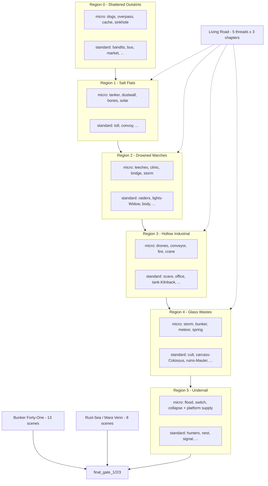

# Ashfall Road story map

How the 112 events break down: short loot scenes, standard scenes, and the long chains. Micro scenes are 35–55 words of setup with 15–30 word outcomes; chains keep full prose.

## Scene taxonomy

| Role | Body | Outcome | Count | Examples |
|---|---|---|---|---|
| `micro` | 35–55 | 15–30 | 24 | sinkhole, tanker, clinic, crane, spring, drop |
| `compact` (default) | 60–100 | 30–65 | ~60 | bus (control), fights, checks, globals |
| `substantial` | 110–180 | 60–110 | ~20 | toll, market, lights, tank, gates 2 |
| `chapter` | 180–280 | 100–180 | ~5 | bunker cartographer, final gate 3 |
| `finale` | 180–280 | 150–260 | 1 | final gate 1 |

Micro scenes are one-shot loot, crossings, and weather. They never carry `body_variants`, never gate chains, and never host the opening draw. Fights and hard checks stay `compact` or longer.

## Run structure

## Long chains (keep full prose)

- **Bunker Forty-One** (13 scenes, `bunker41_events.json`): static → hatch → cartographer/door/ash → warden → door closes. Key, Choir, and testimony flags route the finale.
- **Rust-Sea / Mara Venn** (8 scenes, `rustsea_events.json`): green line → quay/false coordinates → arrivals → salt crown → debt → voice map → last coordinate. Requires Bunker hooks; betraying or helping Mara rewrites the Spire.
- **Living Road** (15 callbacks, 5 threads × 3): family_on_nine, quiet_column, road_debt, water_commons, nightfire_caravan. One callback per region max; missed chapters expire.
- **Finale** (3 stages): gate code/testimony/Key checks route to Bunker or Citadel endings.

## Build-item acquisition map (Phase A)

| Item | Source | Gate |
|---|---|---|
| rusted_machete | outskirts_dogs victory | kill feral dogs |
| wolf_fang_charm | outskirts_bandits critical_victory | flawless leader kill |
| purifier_poultice | marsh_body success / pox_dogs victory | favorable check / sinkhole kill |
| officer_revolver | flats_toll victory | break the barricade |
| bone_cleaver | marsh_raiders victory | kill bog raiders |
| mutant_hide_vest | marsh_lights victory | kill reed widow |
| rail_spike_rifle | industrial_scavs victory | beat vault guards |
| kiln_plates | industrial_fire success / cinder_mauler victory | risky check / ruins kill |
| sniper_scope | glass_carcass success | hard check |
| choir_incense | glass_cult success / salt_colossus victory | hard check / apex kill |
| kiln_sword (relic) | glass_cult victory | desperate-flee fight |
| nail_smg | rail_hunters victory | kill tunnel hunters |
| stalker_cloak, mutant_serum | rail_nest victory / bile_spewer victory | kill stalker / bridge kill |
| gunslinger_holster | global_drop success | supply cache |
| chain_wrench | outskirts_bandits victory | kill road bandits |
| slag_maul | industrial_scavs victory | beat vault guards |
| wire_rifle | rail_signal victory | clear cable run |
